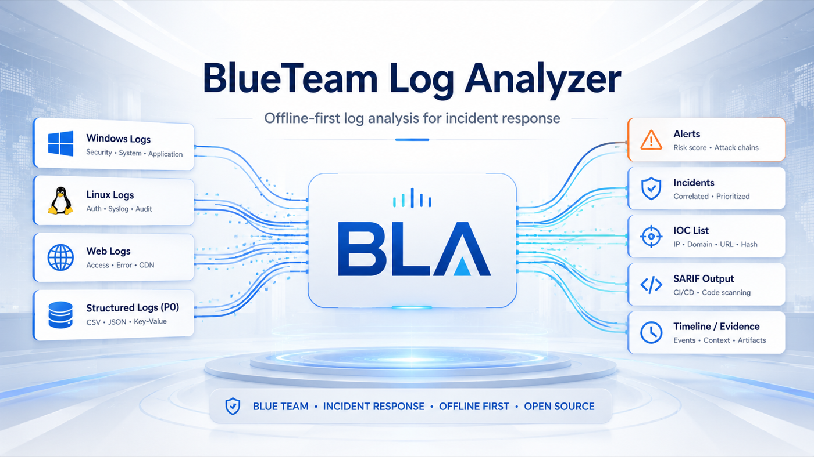
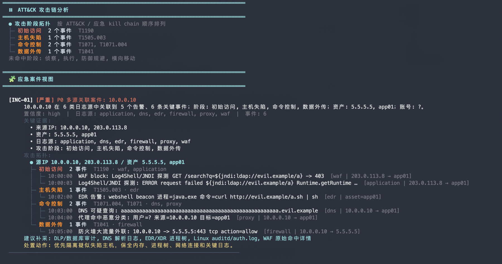
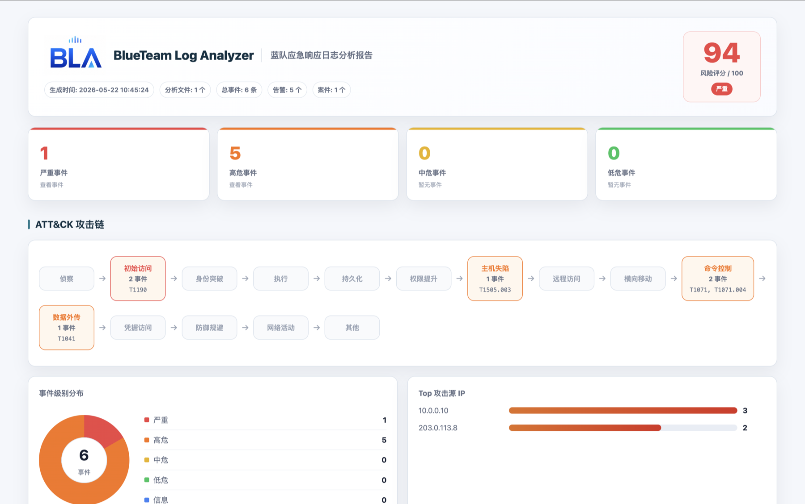
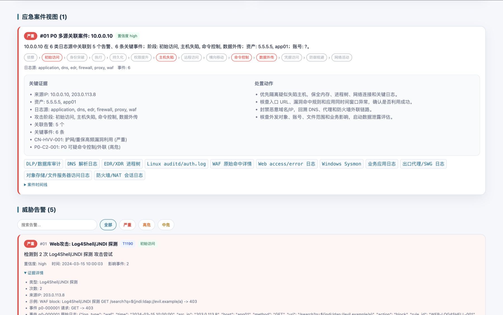

# BlueTeam Log Analyzer

<p align="center">
  
</p>

<p align="center">
  <strong>离线蓝队日志分析器：把混杂日志变成告警、Incident、攻击链、IOC 和 SARIF</strong><br>
  面向应急响应、HVV/重保、值守复盘、样本验证和 CI 安全门禁
</p>

<p align="center">
  <a href="https://pypi.org/project/blueteam-log-analyzer/"></a>
  <a href="https://www.python.org/"></a>
  <a href="LICENSE"></a>
  
  
</p>

BLA 是一个离线优先的蓝队日志分析工具。它把 Windows、Linux、Web、HVV/重保 P0 结构化安全日志统一解析成事件，再做富化、检测、关联和报告输出，帮助安全团队快速回答几个应急现场最常见的问题：

- 谁在攻击，命中了哪些入口？
- 哪台资产、哪个账号、哪个会话可能已经失陷？
- 事件能不能串成一条可信攻击链？
- 哪些 IOC、命令、进程、URL、账号需要进入封禁、排查或工单？
- 结果能不能同时给人看，也能交给 SIEM、CI 或 Code Scanning 继续处理？

所有分析默认在本机完成，不上传日志，不依赖在线服务；HTML 报告也是离线单文件。

## 快速开启

先确认安装成功：

```bash
pip install -U blueteam-log-analyzer
bla --version
```

分析一个日志目录：

```bash
bla logs/
```

需要生成完整报告时再加输出目录：

```bash
bla logs/ --out report/
```

分析完成后打开 `report/index.html`。报告目录会同时生成：

| 文件 | 用途 |
| --- | --- |
| `index.html` | 离线 HTML 报告，适合值守、复盘和汇报 |
| `report.json` | 完整结构化结果，适合二次分析和自动化 |
| `events.csv` | 事件明细，适合 Excel 排查 |
| `iocs.txt` | IOC 清单，适合封禁、狩猎和工单流转 |
| `report.sarif` | SARIF 2.1.0，适合 GitHub Code Scanning 等平台 |
| `manifest.json` | 交付清单和文件哈希 |

需要解释某个案件或告警时：

```bash
bla explain inc-001 --report report/report.json
```

## v1.4.0

以前一些场景里，顶部 ATT&CK 攻击链、Incident 攻击拓扑和告警详情可能使用不同的阶段口径，导致同一批事件在不同视图里看起来数量或阶段不一致。这个版本把阶段语义、事件计数和报告展示统一到同一套逻辑上。

| 方向 | v1.4.0 变化 |
| --- | --- |
| 攻击链一致性 | ATT&CK 阶段拓扑、Incident 攻击拓扑、告警阶段统一按事件语义归类 |
| 事件计数 | 攻击链按唯一事件计数，告警只补充阶段和技术信息，避免 alert + event 双重计数 |
| P0 多源链路 | WAF、应用、EDR、DNS、代理、防火墙等日志可稳定串出入口、失陷、外联和外传 |
| 阶段语义 | Webshell 归入主机失陷，sudo shell 归入权限提升，暴力破解/密码喷洒归入身份突破，敏感文件探测归入侦察 |
| 报告展示 | 终端和 HTML kill chain 阶段列表同步扩展，减少报告视图之间的口径差 |
| 回归测试 | 新增阶段归类、告警阶段、P0 golden incident 和报告展示一致性测试 |

更多变更见 [v1.4.0 发布说明](https://github.com/Hackerchen716/blueteam-log-analyzer/blob/main/docs/releases/v1.4.0.md)，历史版本见 [docs/releases](https://github.com/Hackerchen716/blueteam-log-analyzer/tree/main/docs/releases)

## 多源攻击链示例

下面是一组 HVV/重保 P0 样本的终端和报告截图。6 条关键事件来自 WAF、应用、EDR、DNS、代理和防火墙，BLA 会把它们关联成同一个 Incident，并保持 ATT&CK 拓扑、案件拓扑和告警阶段一致。





终端视图适合一线值守先判断“是否成链”，HTML 报告适合复盘时回答“入口是什么、主机是否失陷、是否有外联和外传”。

## 核心能力

| 能力 | 说明 |
| --- | --- |
| 多源解析 | Windows XML/EVTX、Linux auth.log/secure、Apache/Nginx access log、HVV/重保 P0 CSV/JSONL/JSON/key=value、通用文本日志 |
| 检测规则 | 覆盖暴力破解、密码喷洒、Web 攻击、横向移动、权限提升、持久化、防御规避、凭据访问、可疑执行、C2 外联、数据外传等场景 |
| 国内画像 | `--profile cn-hvv` 增强 Shiro、Fastjson、Struts2、ThinkPHP、WebLogic、Spring、Webshell、敏感路径探测等常见痕迹 |
| Incident 关联 | 按 IP、账号、主机、资产、URL、session、trace 等线索聚合事件和告警，输出可处置案件视图 |
| 攻击链还原 | 按 ATT&CK / 应急 kill chain 顺序展示阶段、技术编号、日志源和关键事件 |
| IOC 提取 | 提取 IP、域名、URL、Hash、账号、路径、进程、命令，并过滤静态资源和低价值噪音 |
| 报告交付 | 一次生成 HTML、JSON、CSV、IOC、SARIF、manifest，兼顾人工研判和系统集成 |
| 离线与自动化 | 本地离线运行，支持 `--exit-on`、`benchmark`、Remote Workspace、规则校验和 CI 流水线 |

## 支持的日志

| 日志类型 | 输入格式 | 典型用途 |
| --- | --- | --- |
| Windows 事件日志 | `.xml`、`.evtx` | 登录、RDP、账号变更、服务安装、计划任务、日志清除、Sysmon 进程与网络行为 |
| Linux 认证日志 | `auth.log`、`secure` | SSH 爆破、成功登录、sudo、root 登录、账号创建 |
| Web 访问日志 | Apache/Nginx Combined | SQLi、XSS、LFI/RFI、RCE、扫描器、敏感文件探测、异常流量 |
| HVV/重保 P0 日志 | CSV、JSONL、JSON object、JSON 数组、key=value | WAF、VPN、堡垒机、DNS、代理/NAT、防火墙、EDR、应用日志 |
| 通用文本日志 | 任意文本 | 关键字提取、轻量告警和 IOC 辅助提取 |

EVTX 二进制解析是可选能力：

```bash
pip install -U "blueteam-log-analyzer[evtx]"
```

未安装 EVTX 依赖时，BLA 会明确提示转换方案，不会静默产出空报告。

## 常用工作流

### 分析本地日志目录

```bash
bla /var/log/ --out report/ --exit-on none
```

自动识别不准时可以指定解析器：

```bash
bla access.log --type web-access --out report/
bla Security.xml --type windows-xml --out report/
bla hvv_chain.jsonl --type p0-security --profile cn-hvv --out report/
```

### HVV/重保多源研判

```bash
bla p0-logs/ --type p0-security --profile cn-hvv --out hvv-report/ --exit-on none
```

建议第一轮优先采集 WAF、CDN/SLB、Web access、应用日志、VPN/零信任、堡垒机、AD/域控、EDR/XDR、DNS、出口代理、防火墙/NAT、NDR/全流量、数据库审计和云审计。完整采集矩阵可由 CLI 输出：

```bash
bla --list-log-sources
```

### Windows 日志分析

导出 EVTX：

```powershell
wevtutil epl Security Security.evtx /ow:true
wevtutil epl System System.evtx /ow:true
wevtutil epl "Microsoft-Windows-Sysmon/Operational" Sysmon.evtx /ow:true
```

导出无额外依赖的 XML：

```powershell
wevtutil qe Security /f:RenderedXml /e:Events > Security.xml
wevtutil qe System /f:RenderedXml /e:Events > System.xml
wevtutil qe "Microsoft-Windows-Sysmon/Operational" /f:RenderedXml /e:Events > Sysmon.xml
```

分析：

```bash
bla Security.evtx System.evtx Sysmon.evtx --out windows-report/
bla Security.xml System.xml Sysmon.xml --out windows-report/
```

只看 RDP 登录：

```bash
bla Security.xml --rdp --json rdp.json --exit-on none
```

### 远程只读采集

目标主机无法安装 Python、pip 或 BLA 时，可以用 Remote Workspace 在本机分析远程日志。远程侧只需要 SSH 和系统自带命令。

```bash
bla remote-log root@server.example.com /var/log/auth.log \
  --tail 1000 \
  --grep "Failed password" \
  --out case-auth \
  --audit-json case-auth-audit.json \
  --exit-on none
```

也可以进入交互式工作台：

```bash
bla ssh root@server.example.com
```

工作台内支持 `ls`、`cd`、`find`、`tail`、`bla FILE`、`bla FILE --tail N --grep TEXT`、`bla journalctl:ssh` 等命令。

### CI 和流水线门禁

```bash
# 高危及以上告警时退出 1
bla logs/ --exit-on high --json result.json --sarif report.sarif

# GitHub Code Scanning
gh code-scanning upload-sarif --sarif report.sarif
```

`--exit-on` 可选 `none`、`low`、`medium`、`high`、`critical`，默认是 `critical`。

### 自定义规则和误报压制

加载自定义 YAML Web 检测规则：

```bash
bla access.log --rules ./rules --profile cn-hvv --out report/
bla validate-rules --strict-metadata
```

使用 allowlist 压制可信扫描器、维护窗口或已知噪音：

```bash
bla logs/ --allowlist docs/allowlist-example.json --out report/
```

## 检测覆盖

| 类别 | 示例 | MITRE ATT&CK |
| --- | --- | --- |
| 侦察 | 扫描器、敏感文件探测、目录枚举 | T1595, T1083 |
| 初始访问 | Web 漏洞利用、Log4Shell/JNDI、国内常见 Web 漏洞痕迹 | T1190 |
| 身份突破 | SSH/RDP/Kerberos 暴力破解、密码喷洒、爆破后成功登录 | T1110.001, T1110.003 |
| 执行 | 高危 PowerShell、命令注入、LOLBins | T1059, T1218 |
| 持久化 | 服务安装、计划任务、账号创建 | T1543.003, T1053.005, T1136 |
| 权限提升 | sudo shell、特权组变更、root 直接登录 | T1548.003, T1098.001 |
| 主机失陷 | Webshell、EDR/XDR 高危终端告警、恶意进程痕迹 | T1505.003 |
| 横向移动 | RDP 跳转、显式凭据、Pass-the-Hash 指示器 | T1021.001, T1550.002 |
| 命令控制 | DNS 隧道、高风险代理访问、C2 外联 | T1071, T1071.004, T1105 |
| 数据外传 | 大流量外联、敏感数据外传迹象 | T1041 |
| 凭据访问 | Mimikatz、LSASS 访问、凭据转储 | T1003.001 |
| 防御规避 | 日志清除、审计策略修改、安全能力关闭 | T1070.001, T1562.002 |

## 报告截图



## 文档

| 文档 | 内容 |
| --- | --- |
| [架构说明](https://github.com/Hackerchen716/blueteam-log-analyzer/blob/main/docs/architecture.md) | 解析、富化、检测、关联、输出的可扩展设计 |
| [演示案例库](https://github.com/Hackerchen716/blueteam-log-analyzer/blob/main/docs/demo-cases.md) | 样例、复现命令和功能覆盖矩阵 |
| [SecRepo 样本验证](https://github.com/Hackerchen716/blueteam-log-analyzer/blob/main/docs/secrepo-sample-validation.md) | 公开 auth.log 和 Web access.log 实测记录 |
| [测试资源清单](https://github.com/Hackerchen716/blueteam-log-analyzer/blob/main/docs/testing-resources.md) | 可用于评估日志分析能力的公开资源 |
| [发布检查清单](https://github.com/Hackerchen716/blueteam-log-analyzer/blob/main/docs/release-checklist.md) | GitHub Release 和 PyPI 发布前检查项 |
| [历史版本](https://github.com/Hackerchen716/blueteam-log-analyzer/tree/main/docs/releases) | 每个版本的发布说明 |

## 开发与测试

```bash
git clone https://github.com/Hackerchen716/blueteam-log-analyzer.git
cd blueteam-log-analyzer

python3 bla_cli.py --help
python3 -m compileall -q bla bla_cli.py setup.py tests
python3 -m unittest discover -s tests -v
python3 scripts/release_check.py
```

当前回归测试覆盖解析、检测、Incident 关联、攻击链阶段、HTML/JSON/CSV/IOC/SARIF 输出、Remote Workspace、规则校验、报告安全转义、终端控制字符清理、P0 多源 golden incident 和发布质量检查。

包版本由 `bla/__version__.py` 作为单一版本源，`pyproject.toml` 和 `setup.py` 都读取同一来源。发布前请按 [release checklist](https://github.com/Hackerchen716/blueteam-log-analyzer/blob/main/docs/release-checklist.md) 执行完整检查。

## 项目结构

```text
bla/
  parsers/      日志解析器和自动识别入口
  detection/    富化、检测器、规则注册和 Incident 关联
  output/       终端、HTML、JSON、CSV、IOC、SARIF、manifest、报告包
  remote/       SSH 远程日志工作台
  rules/        内置 YAML Web 检测规则
docs/           架构、案例、发布说明、测试资源和截图
sample_logs/    本地 smoke 示例日志
tests/          回归测试和 P0 golden fixture
scripts/        发布检查脚本
```

## 参与贡献

欢迎提交 Issue 或 Pull Request，尤其是这些方向：

- 补充真实环境中常见的安全设备、主机、Web 服务和业务日志格式。
- 扩展 Web 攻击、身份突破、横向移动、权限变更、可疑执行、日志清除、C2 外联和数据外传检测规则。
- 改进 allowlist、可信扫描器、维护窗口和基线压制能力。
- 优化 HTML / JSON / CSV / IOC / SARIF 报告，让结果更适合值守、复盘和工单流转。
- 补充脱敏样本、单元测试、回归测试和性能测试。

请不要提交真实客户日志、敏感 IP、账号、Cookie、Token、业务数据或未脱敏截图。

交流与合作：`hackerchen7@proton.me`

## 许可证

[MIT License](LICENSE) © 2026 Hackerchen716
