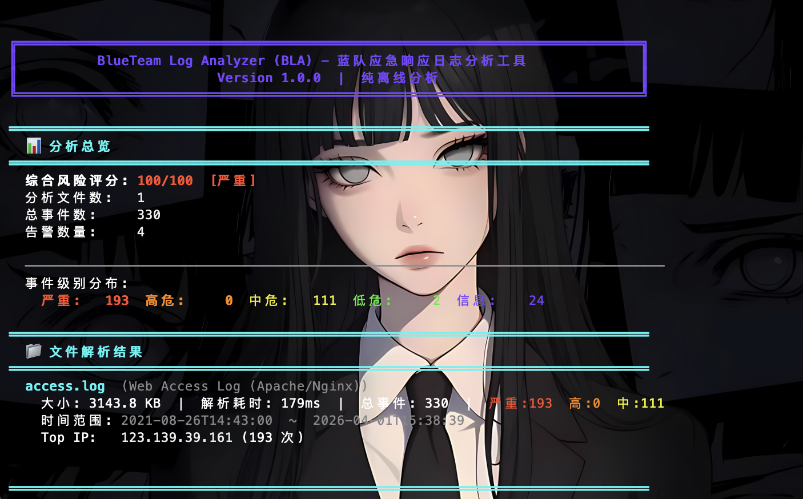
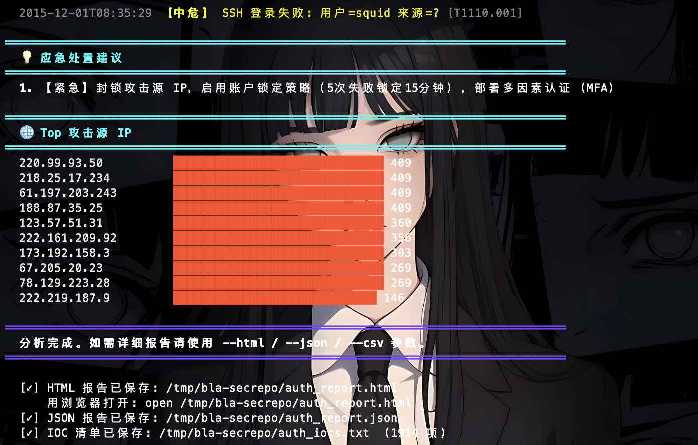

# BlueTeam Log Analyzer (BLA)

> 蓝队应急响应日志分析工具 | Blue Team Incident Response Log Analyzer

[](https://www.python.org/)
[](https://github.com/Hackerchen716/blueteam-log-analyzer)
[](LICENSE)
[](https://github.com/Hackerchen716/blueteam-log-analyzer)

**BLA** 是一款面向蓝队应急响应场景的日志分析工具，支持 Windows 事件日志、Linux 认证日志、Web 访问日志等多种格式，内置 70+ 条威胁检测规则，完全离线运行，无需任何第三方服务。

---

## 功能特性

- **多格式解析**：Windows XML/EVTX、Linux auth.log/secure、Apache/Nginx 访问日志、通用文本日志（自动识别类型）
- **70+ 检测规则**：覆盖 MITRE ATT&CK 9 个阶段，包括暴力破解、密码喷洒、横向移动、权限提升、持久化、防御规避、凭据访问、Web 攻击等
- **护网/重保画像**：`--profile cn-hvv` 增强 Shiro、Fastjson、Struts2、ThinkPHP、WebLogic、Spring、Webshell 等国内常见痕迹检测
- **攻击链还原**：自动关联多文件事件，还原 ATT&CK 攻击链
- **IOC 提取**：一键导出 IP、域名、URL、文件路径、Hash、账户、进程和可疑命令
- **白名单压制**：支持 JSON allowlist 过滤可信 IP、账户、路径、进程、UA，降低真实环境误报
- **风险评分**：0-100 综合评分，4 级威胁分级（严重/高危/中危/低危）
- **多格式输出**：终端彩色报告、独立 HTML 报告（含离线图表）、JSON、CSV、IOC 文本
- **完全离线**：无网络请求，无 AI 调用，所有规则内置，适合隔离网络环境
- **零依赖**：Python 3.9+ 标准库即可运行

---

## 支持的日志类型

| 日志类型 | 格式 | 说明 |
|---------|------|------|
| Windows 事件日志 | `.xml`（wevtutil 导出） | 安全/系统/应用/Sysmon 日志 |
| Windows EVTX | `.evtx`（二进制） | 需安装 `python-evtx`（可选） |
| Linux 认证日志 | `auth.log` / `secure` | SSH / Sudo / PAM / useradd |
| Web 访问日志 | Apache/Nginx Combined | SQL 注入/XSS/LFI/RCE/扫描器检测 |
| 通用文本日志 | 任意格式 | 关键字提取与告警 |

---

## 检测规则覆盖

| 类别 | 规则示例 | MITRE ATT&CK |
|------|---------|-------------|
| 暴力破解 | SSH/RDP/Kerberos 失败登录聚合 | T1110.001 |
| 密码喷洒 | 多账户低频尝试识别 | T1110.003 |
| 横向移动 | RDP 跳转、显式凭据（PtH 指示器） | T1021.001, T1550.002 |
| 权限提升 | 添加到特权组、Sudo 滥用、Root 直接登录 | T1098.001, T1548.003 |
| 持久化 | 服务安装、计划任务创建、账户创建 | T1543.003, T1053.005, T1136 |
| 防御规避 | 日志清除（EventID 1102/104）、审计策略修改 | T1070.001, T1562.002 |
| 凭据访问 | Mimikatz 特征、LSASS 访问（EventID 4656） | T1003.001 |
| 可疑执行 | 高危 PowerShell、LOLBins（certutil/regsvr32 等） | T1059.001, T1218 |
| Web 攻击 | SQL 注入、XSS、路径遍历、命令注入、Webshell | T1190, T1059.007 |
| 侦察 | 扫描器识别（Nikto/sqlmap/nmap）、敏感文件探测 | T1595, T1083 |
| 护网画像 | Shiro/Fastjson/Struts2/ThinkPHP/WebLogic/Spring/Webshell | T1190, T1505.003 |

---

## 安装

### 环境要求

- Python 3.9 或更高版本
- 操作系统：Windows 10/11、macOS 12+、Ubuntu 20.04+（及其他主流 Linux 发行版）

### macOS / Linux

```bash
# 克隆仓库
git clone https://github.com/Hackerchen716/blueteam-log-analyzer.git
cd blueteam-log-analyzer

# 方法一：直接运行（无需安装）
python3 bla_cli.py --help

# 方法二：安装为系统命令 bla
chmod +x install.sh
./install.sh
```

### Windows

```powershell
# 克隆仓库
git clone https://github.com/Hackerchen716/blueteam-log-analyzer.git
cd blueteam-log-analyzer

# 方法一：直接运行
python bla_cli.py --help

# 方法二：运行安装程序（需管理员权限）
install.bat

# 方法三：将 bla.cmd 所在目录加入 PATH，即可全局使用 bla 命令
```

### 可选：EVTX 二进制解析支持

```bash
pip install python-evtx
```

安装后可直接解析 `.evtx` 二进制文件，无需先用 wevtutil 转换为 XML。

---

## 使用方法

### 基本用法

```bash
# 分析单个文件（自动识别类型）
bla /var/log/auth.log

# 分析多个文件
bla /var/log/auth.log /var/log/nginx/access.log

# 分析整个目录（递归）
bla /var/log/

# 通配符（Linux/macOS）
bla /path/to/logs/*.xml
```

### 输出选项

```bash
# 生成 HTML 报告（推荐，含离线图表，浏览器打开）
bla auth.log --html report.html
open report.html          # macOS
start report.html         # Windows

# 生成 JSON 报告（便于二次处理/SIEM 导入）
bla auth.log --json report.json

# 导出 CSV（便于 Excel 分析）
bla auth.log --csv events.csv

# 导出 IOC 清单（便于封禁、研判、工单流转）
bla logs/ --ioc iocs.txt

# 同时生成所有格式
bla logs/ --html report.html --json report.json --csv events.csv --ioc iocs.txt

# 国内护网/重保增强画像
bla logs/ --profile cn-hvv --html report.html --ioc iocs.txt

# 使用白名单压制已知可信噪音
bla logs/ --allowlist docs/allowlist-example.json --html report.html

# 详细模式（显示所有高危以上事件）
bla auth.log --verbose

# 大型日志终端只看前 100 个告警（JSON/HTML 仍保留完整结果）
bla auth.log --max-alerts 100

# 分析历史 syslog/auth.log（日志本身不含年份时指定年份）
bla auth.log --syslog-year 2024

# 禁用彩色输出（重定向到文件时使用）
bla auth.log --no-color > report.txt
```

### Windows 日志导出

在 Windows 主机上导出日志，拷贝到分析机后使用 BLA 分析：

```powershell
# 导出安全日志（推荐）
wevtutil epl Security Security.xml /lf:true

# 导出系统日志
wevtutil epl System System.xml /lf:true

# 导出 Sysmon 日志（需已安装 Sysmon）
wevtutil epl "Microsoft-Windows-Sysmon/Operational" Sysmon.xml /lf:true

# 导出 PowerShell 日志
wevtutil epl "Microsoft-Windows-PowerShell/Operational" PowerShell.xml /lf:true

# 分析（在任意平台）
bla Security.xml System.xml Sysmon.xml --html incident_report.html
```

### 退出码

| 退出码 | 含义 |
|--------|------|
| `0` | 分析完成，无严重告警 |
| `1` | 发现严重（Critical）告警 |
| `130` | 用户中断（Ctrl+C） |

退出码可用于自动化告警脚本：

```bash
bla /var/log/auth.log --json /tmp/result.json
if [ $? -eq 1 ]; then
    echo "发现严重威胁！" | mail -s "BLA Alert" security@example.com
fi
```

---

## 📸 工具展示

### 分析总览 & 文件解析结果



### 威胁告警详情


---

## 真实样本演示

已使用 SecRepo 公开日志完成实测，覆盖 Linux auth.log 和 Web access.log 两类场景：

| 样本 | 原始行数 | 解析事件 | 告警 | 风险 | 主要验证能力 |
|------|----------|----------|------|------|--------------|
| SecRepo auth.log | 86,839 | 27,075 | 624 | 100/100（严重） | SSH 暴力破解、密码喷洒、Top IP/Top User、IOC 提取 |
| SecRepo Web access.log | 2,928 | 236 | 2 | 100/100（严重） | 敏感路径探测、Web 访问日志解析、`cn-hvv` 画像、IOC 提取 |

完整复现命令、数据来源和结果摘要见 [SecRepo 真实样本实测演示](docs/secrepo-demo.md)。

### SecRepo auth.log 实测总览


### 暴力破解告警详情


### Top 攻击源 IP 与报告输出



---

## 输出示例

### 终端报告

```
╔══════════════════════════════════════════════════════════════════════════════╗
║         BlueTeam Log Analyzer (BLA)  -  Blue Team Incident Response          ║
║                    Version 1.0.0  |  100% Offline  |  No AI                  ║
╚══════════════════════════════════════════════════════════════════════════════╝

📊 分析总览
  综合风险评分: 87/100  [高危]
  分析文件数:   3
  总事件数:     1,247
  告警数量:     12

⛓ ATT&CK 攻击链分析
  ▶ 侦察 (13 事件) → ▶ 初始访问 (3 事件) → ▶ 执行 (4 事件)
  → ▶ 持久化 (2 事件) → ▶ 权限提升 (2 事件) → ▶ 凭据访问 (29 事件)

🚨 威胁告警
  [01] [严重] Web攻击: 命令注入/代码执行
  [02] [高危] 暴力破解攻击 (192.168.1.100, 失败 50 次)
  [03] [高危] 密码喷洒攻击 (针对 17 个账户)
  ...

💡 应急处置建议
  1. 【紧急】封锁攻击源 IP 192.168.1.100
  2. 【高危】审查 root 账户直接登录记录
  ...
```

### HTML 报告功能

- 风险评分仪表盘
- 事件级别分布图（纯 HTML/CSS，无需联网）
- Top 攻击源 IP 柱状图（纯 HTML/CSS，无需联网）
- ATT&CK 攻击链可视化
- IOC 摘要（IP、域名、URL、路径、Hash、账户、进程、命令）
- 告警过滤（按级别/关键词搜索）
- 关键事件时间线（支持滚动）
- 应急处置建议

---

## 开发与测试

```bash
# 语法检查
python3 -m compileall -q bla bla_cli.py setup.py tests

# 回归测试（仅使用 Python 标准库）
python3 -m unittest discover -s tests -v
```

当前回归测试覆盖：

- HTML 报告对日志内容做转义，避免攻击日志触发报告 XSS
- HTML 报告不依赖外部 CDN，保持离线可用
- Web payload 中带空格或 URL 编码时仍可识别 SQL 注入 / XSS
- 高频 200 请求可生成扫描/洪泛类告警
- Windows XML 异常字段不会导致整条事件被静默丢弃
- IOC 提取与 `--ioc` 文本导出
- `--profile cn-hvv` 国内护网/重保增强画像
- `--allowlist` 白名单误报压制
- 大型日志可通过 `--max-alerts` 控制终端告警展示数量
- 可通过 `--syslog-year` 固定 Linux syslog 无年份时间戳

更多可用于评估 BLA 的公开日志与靶场资源见 [测试资源推荐清单](docs/testing-resources.md)。
SecRepo 真实样本的完整复现实测见 [SecRepo 真实样本实测演示](docs/secrepo-demo.md)。

---

## 项目结构

```
blueteam-log-analyzer/
├── bla_cli.py              # CLI 主入口
├── bla/
│   ├── models.py           # 数据模型（LogEvent, DetectionAlert, AnalysisSummary 等）
│   ├── parsers/
│   │   ├── __init__.py     # 自动类型识别路由
│   │   ├── windows_evtx.py # Windows 事件日志解析（XML/EVTX）
│   │   ├── linux_auth.py   # Linux 认证日志解析
│   │   ├── web_access.py   # Web 访问日志解析（Apache/Nginx Combined）
│   │   └── stats.py        # 统计计算（Top IP、Top User、时间范围等）
│   ├── detection/
│   │   └── engine.py       # 威胁检测引擎（70+ 规则，ATT&CK 映射）
│   ├── output/
│   │   ├── terminal.py     # 终端彩色输出（ANSI，支持 Windows 10+）
│   │   ├── html_report.py  # HTML 报告生成（独立单文件）
│   │   ├── json_report.py  # JSON 报告输出
│   │   ├── csv_report.py   # CSV 事件导出
│   │   └── ioc_report.py   # IOC 清单导出
│   └── utils/
│       └── helpers.py      # 工具函数
├── docs/
│   ├── screenshots/        # 演示截图
│   ├── allowlist-example.json # 白名单示例
│   ├── secrepo-demo.md     # SecRepo 真实样本实测演示
│   └── testing-resources.md# 测试资源推荐清单
├── sample_logs/
│   ├── auth.log            # Linux SSH 暴力破解示例日志
│   └── access.log          # Web 攻击示例日志（SQLi/XSS/LFI/扫描）
├── tests/
│   └── test_regressions.py # 安全与解析回归测试
├── install.sh              # macOS/Linux 安装脚本
├── install.bat             # Windows 安装脚本
├── bla.cmd                 # Windows 快捷启动脚本
├── setup.py                # Python 包安装配置
└── README.md
```

---

## 设计原则

- **准确率优先**：规则基于真实攻击场景设计，参考 Hayabusa、DeepBlueCLI、Sigma 等成熟项目的检测逻辑
- **完全离线**：无网络请求，无外部 API 调用，适合隔离网络和保密环境
- **零依赖**：Python 3.9+ 标准库即可运行，EVTX 二进制解析为可选依赖
- **高性能**：1000 行日志解析耗时 < 100ms
- **可扩展**：规则以 Python 代码形式组织，易于添加自定义检测逻辑

---

## 参考与致谢

本项目在设计和规则制定过程中参考了以下优秀开源项目，特此致谢：

| 项目 | 参考内容 | 许可证 |
|------|---------|--------|
| [Hayabusa](https://github.com/Yamato-Security/hayabusa) | Windows 事件日志检测规则体系、Event ID 覆盖范围 | GPL-3.0 |
| [Chainsaw](https://github.com/WithSecureLabs/chainsaw) | EVTX 快速分析思路、Sigma 规则集成方式 | Apache-2.0 |
| [DeepBlueCLI](https://github.com/sans-blue-team/deepbluecli) | PowerShell 检测规则、LOLBins 检测逻辑 | MIT |
| [OSTE-Web-Log-Analyzer](https://github.com/OSTEsayed/OSTE-Web-Log-Analyzer) | Web 攻击检测模式（SQLi/XSS/LFI） | MIT |
| [Sigma](https://github.com/SigmaHQ/sigma) | 通用检测规则格式参考、MITRE ATT&CK 映射方法 | DRL-1.1 |

> **注意**：本项目为独立实现，未直接复制上述项目的代码。检测规则参考了上述项目的检测思路和攻击模式，并根据实际应急响应场景进行了重新设计和实现。

---

## 贡献

欢迎提交 Issue 和 Pull Request。如需添加新的检测规则，请参考 `bla/detection/engine.py` 中的规则格式。

---

## 许可证

[MIT License](LICENSE) © 2026 Hackerchen716
